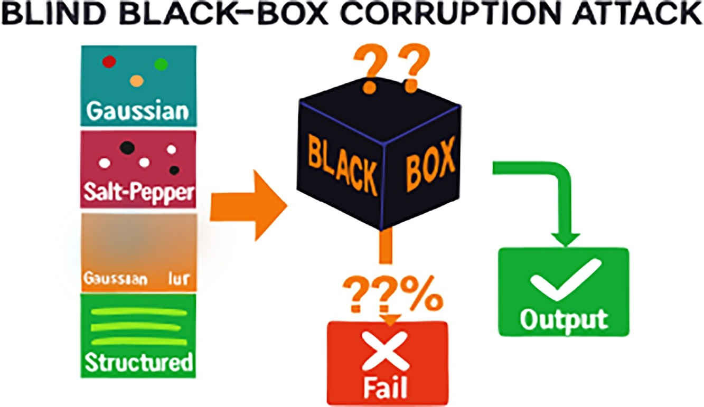
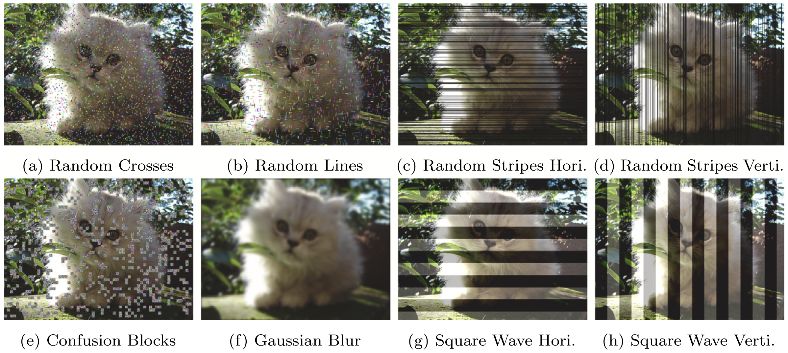
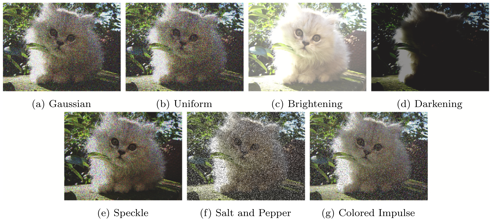

# Blind Confusion of Classification Networks

> **Blind confusion of classification networks: A black box evaluation under common and structured image corruptions**  
> *Neurocomputing, Volume 686, Article 133678, 2026*  
> DOI: https://doi.org/10.1016/j.neucom.2026.133678  
> Paper: https://www.sciencedirect.com/science/article/pii/S0925231226010751

This repository contains the code and supporting files for the experiments related to the paper **Blind confusion of classification networks: A black box evaluation under common and structured image corruptions**.

The project evaluates image classification models under common and structured image corruptions in a black box setting. The main idea is simple: change the input image in controlled ways and measure how model accuracy and confidence respond.

The code was originally developed under the thesis project **Blind Confusion of Neural Networks** and later organized as a reference implementation for the paper.

## Visual overview



The paper evaluates how different image corruptions affect classification models when only the input and output behavior are considered. The examples below show the two main corruption families used in the study.

**Structured corruptions**



**Common corruptions**



## What the paper covers

The paper studies how image classification networks behave when visual input quality is degraded by different corruption types. It focuses on three practical points:

1. how accuracy changes under increasing corruption intensity
2. how model confidence behaves when predictions become wrong
3. how standard corruptions compare with structured perturbations such as random lines, random crosses and confusion blocks

The experiments use ImageNet ILSVRC2012 validation images and evaluate multiple model families, including conventional CNNs, modern CNNs, robustified models and vision transformer based models.

The paper also discusses Accuracy Confidence Divergence, abbreviated as ACD, to compare the relationship between prediction correctness and confidence under corruption.

## Repository contents

```text
.
├── main_Blind_Confusion.py        # main experiment runner
├── corruptions.py                 # corruption and noise functions
├── models.py                      # model loading utilities
├── env.yml                        # conda environment file
├── reproducibilty_comp_Info.txt   # hardware, software and package record
├── map_synset.txt                 # ImageNet synset to numeric label mapping
├── synset_words.txt               # ImageNet synset names and descriptions
├── dataset_reference.md           # ImageNet reference note
├── assets/                        # reference figures used in README
│   ├── graphical_abstract.jpg
│   ├── structured_corruptions.jpeg
│   └── common_corruptions.jpeg
└── README.md
```

`map_synset.txt` and `synset_words.txt` are used to connect ImageNet numeric labels with synset names and readable class names.

## Dataset

This repository uses the **ImageNet ILSVRC2012 validation set**.

ImageNet images are not included in this repository. The dataset must be obtained separately and used according to the ImageNet terms.

The code expects each validation image filename to include the numeric ground truth label at the end of the filename.

Example:

```text
ILSVRC2012_val_00015618_254.JPEG
```

Here the ground truth label is:

```text
254
```

In practice, the expected naming pattern is:

```text
<original_image_name>_<label>.JPEG
```

The script reads the label from the final underscore separated value before the file extension.

## Environment

Create the conda environment:

```bash
conda env create -f env.yml
conda activate noise-env
```

A practical extra installation command is:

```bash
pip install torch torchvision timm tqdm pillow scikit-image pandas matplotlib seaborn opencv-python
```
The experiment environment was recorded in `reproducibilty_comp_Info.txt`. The recorded setup includes:

```text
Ubuntu 22.04.5 LTS
Python 3.10.16
NVIDIA GeForce RTX 4080
CUDA runtime 12.4
PyTorch 2.0.0+cu117
Torchvision 0.15.1+cu117
timm 1.0.15
```

## Supported corruption types

The code supports 15 corruption types:

```text
confusion
randomstripesvertical
randomstripeshorizontal
randomlines
randomcrosses
structuredsquarewavehorizontal
structuredsquarewavevertical
coloredimpulse
gaussianblur
gaussian
saltnpepper
speckle
uniform
brightening
darkening
```


## Models

Models are loaded through `models.py`. The implementation uses `torchvision` and `timm` models.

Model groups are read from a JSON configuration file. The default expected file name is:

```text
classification_models.json
```

Typical model groups are:

```text
traditional
classic
advanced
robustified
transformers
```

The selected model group must exist in the JSON file.

## Running experiments

Main command line arguments:

```text
--noise_type       corruption type to run
--all              run all corruption types
--group            model group name
--config           model group JSON file
--data_dir         labeled ImageNet validation image folder
--synset_words     ImageNet synset words file
--synset_map       synset to label mapping file
--out_dir          output directory
--batch_size       dataloader batch size
--max_chunk        number of corruption intensities processed per forward pass
--micro_bs         internal micro batch size
--iqa              compute image quality metrics
```
Run all corruption types for one model group:

```bash
python main_Blind_Confusion.py \
  --all \
  --group transformers \
  --config classification_models.json \
  --data_dir /path/to/ILSVRC2012_val_labeled \
  --synset_words synset_words.txt \
  --synset_map map_synset.txt \
  --out_dir classification_results
```

Optional image quality metrics can be enabled with:

```bash
--iqa
```

This adds SSIM, PSNR and KL related fields when supported by the pipeline.

## Output format

The script writes JSONL files. Each line corresponds to one image, one model, one corruption type and one intensity value.

Example:

```json
{
  "filename": "ILSVRC2012_val_00015618_254.JPEG",
  "gt_idx": 254,
  "pred_idx": 445,
  "model": "inception_resnet_v2",
  "noise": "gaussian",
  "noise_id": 10,
  "intensity": 0.2,
  "top1p": 0.8464183807373047,
  "corr": 1,
  "KL": 0.0,
  "SSIM": 0.0,
  "PSNR": 0.0
}
```

Field meaning:

```text
filename    evaluated image name
gt_idx      ground truth ImageNet label parsed from filename
pred_idx    predicted ImageNet label
model       evaluated model name
noise       corruption type
noise_id    numeric corruption id
intensity   corruption intensity value
top1p       top 1 predicted probability
corr        1 if prediction is correct, otherwise 0
KL          KL related image quality field
SSIM        structural similarity field
PSNR        peak signal to noise ratio field
```

## Dataset reference

This project uses ImageNet ILSVRC2012:

```text
Olga Russakovsky*, Jia Deng*, Hao Su, Jonathan Krause, Sanjeev Satheesh,
Sean Ma, Zhiheng Huang, Andrej Karpathy, Aditya Khosla, Michael Bernstein,
Alexander C. Berg and Li Fei-Fei.
ImageNet Large Scale Visual Recognition Challenge.
International Journal of Computer Vision, 2015.
```

A short dataset note is also included in `dataset_reference.md`.

## Citation

If you use this repository, cite the paper:

```bibtex
@article{erkara2026blindconfusion,
  title   = {Blind confusion of classification networks: A black box evaluation under common and structured image corruptions},
  author  = {Erkara, Atam O. and Mayer, Markus},
  journal = {Neurocomputing},
  volume  = {686},
  pages   = {133678},
  year    = {2026},
  doi     = {10.1016/j.neucom.2026.133678}
}
```

Code reference:

```text
Blind Confusion of Neural Networks
GitHub repository: https://github.com/<your-username>/<your-repository>
```

Replace the placeholder with the final public repository URL.

## License and data notice

This repository contains code and metadata files. It does not include ImageNet images.

ImageNet must be obtained from the official source and used according to its license terms. Images included in the README should be used only when redistribution rights allow it. ImageNet images and publisher formatted material are not redistributed as dataset content.
